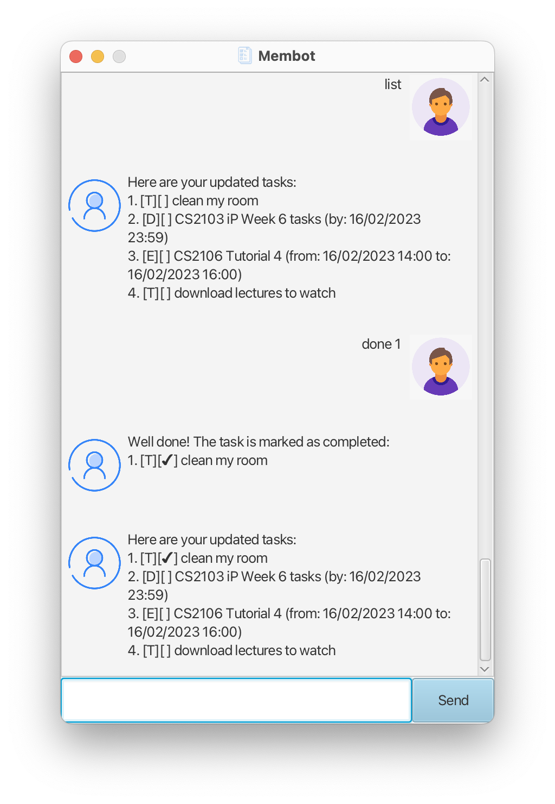

# User Guide

This user guide is written for users who are interested to learn more about how `Membot` works and how to use its features.

## Table of Contents

- [Introduction](#introduction)
- [Getting Started](#getting-started)
- [Features](#features)
- [Commands](#commands)
  - [Show help message - `help`](#show-help-message---help)
  - [View all tasks - `list`](#view-all-tasks---list)
  - [Create a TODO task - `todo`](#create-a-todo-task---todo)
  - [Create a DEADLINE task - `deadline`](#create-a-deadline-task---deadline)
  - [Create a EVENT task - `event`](#create-a-event-task---event)
  - [Find a task - `find`](#find-a-task---find)
  - [Sort all tasks - `sort`](#sort-all-tasks---sort)
  - [Delete a task - `delete`](#delete-a-task---delete)
  - [Mark a task as completed - `done`](#mark-a-task-as-completed---done)
  - [Mark a task as incomplete - `undone`](#mark-a-task-as-incomplete---undone)
  - [Exit Membot - `exit`](#exit-membot---exit)

## Introduction



Membot is your personal chat-bot that helps manage your tasks well! It works well with tasks with a deadline, or even tasks with a starting and ending date. It is built for keyboard users and is blazing fast to use.

## Getting Started

1. Please ensure you have Java 11 or above installed on your computer. You may check your Java version via `java -version`.
2. Download the latest jar from the [release page](https://github.com/Beebeeoii/ip/releases).
3. Copy the file to any directory you wish. Ensure that you have the permissions to read/write in that directory.
4. Run `java -jar membot.jar` in a terminal in that directory to start `Membot`. A data directory will be created in the location you execute the command from.
5. Enjoy using your personal chat-bot `Membot`!

## Features

- [X] Create tasks (`TODO`)
- [X] Create tasks with a deadline (`DEADLINE`)
- [X] Create tasks with a starting date/time and an ending date/time (`EVENT`)
- [X] Delete tasks
- [X] Find tasks by keyword(s)
- [X] Sort tasks by a specified option
- [X] Mark tasks as complete/incomplete
- [X] View all tasks

## Commands

### Show help message - `help`

Shows a help message with all the available commands and their corresponding descriptions.

**Sample input:**

```text
help
```

### View all tasks - `list`

Lists out all tasks.

**Sample input:**

```text
list
```

### Create a TODO task - `todo`

Creates a task with a task title.

**Syntax**: `todo [title]`

**Sample input:**

```text
todo Clean my room
```

### Create a DEADLINE task - `deadline`

Creates a task with a deadline.

**Syntax**: `deadline [title] /by [datetime]`

> Note: `datetime` has to be in the following format if you want this task to be
sortable by `date` - **dd/MM/yyyy HH:mm**.

**Sample input 1:**

```text
deadline CS2103 iP Week 6 /by tomorrow 3pm
```

> This is acceptable, but task will not be regarded when `sort date` is executed.

**Sample input 2:**

```text
deadline CS2103 iP Week 6 /by 15/03/2023 15:00
```

> This task will be regarded when `sort date` is executed.

### Create a EVENT task - `event`

Creates a task with a start and end date/time.

**Syntax**: `event [title] /from [datetime] /to [datetime]`

> Note: `datetime` has to be in the following format if you want this task's start and end date/time
> to be viewed as a `DateTime` object - **dd/MM/yyyy HH:mm**.

**Sample input 1:**

```text
event CS2103 Tutorial 4 /from tomorrow 2pm /to tomorrow 4pm
```

**Sample input 2:**

```text
event CS2103 Tutorial 4 /from 16/03/2023 14:00 /to 16/03/2023 16:00
```

### Find a task - `find`

Finds a task with any given keyword(s).

**Syntax:** `find [keyword(s)]`

**Sample input:**

```text
find cs2103
```

### Sort all tasks - `sort`

Sorts all tasks by a specified order.

Available orders:
- `date` - sorts `deadline` tasks by their deadline recency
- `title` - sorts all tasks by their title
- `status` - sorts all tasks by their completed status

**Syntax:** `sort [date|title|status]`

**Sample input:**

```text
sort date
```

### Delete a task - `delete`

Deletes a task from the list.

**Syntax:** `delete [index]`

> Index is the **index of the task in the list** at a given point in time.

**Sample input:**

```text
delete 5
```

### Mark a task as completed - `done`

Marks a task from the list as completed.

**Syntax:** `done [index]`

> Index is the **index of the task in the list** at a given point in time.

**Sample input:**

```text
done 4
```

### Mark a task as incomplete - `undone`

Marks a task from the list as incomplete.

**Syntax:** `undone [index]`

> Index is the **index of the task in the list** at a given point in time.

**Sample input:**

```text
undone 6
```

### Exit Membot - `exit`

Exits `Membot` safely.
